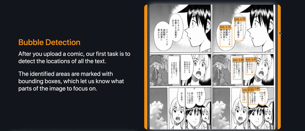
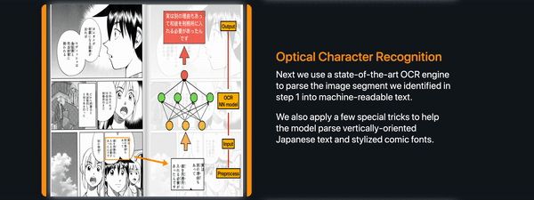
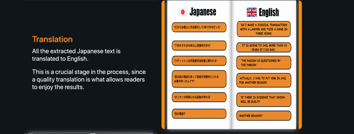
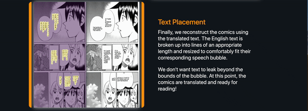
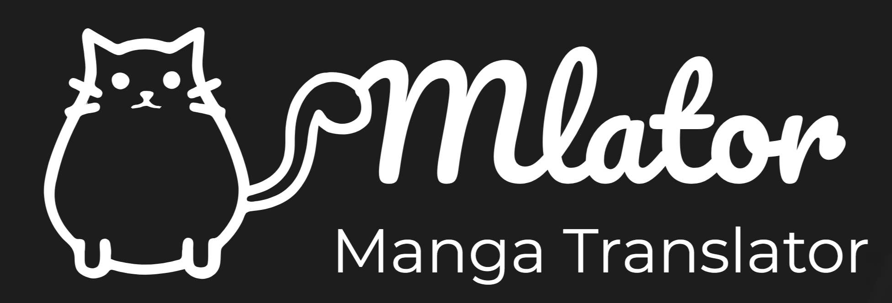

# MLator 
 
# MLator is a project ]to supply the Manga industry with an alternative to slow, low quality automated translation and expensive human translation.

# It is an end to end product, with a backend which controls the logic of the application, a model which does the prediction for translation, and the front end which communicates between the user and the server.

## Model 
### 1. Text Bubble Detection
**SSD**

### 2. OCR
**CRNN**

### 3. Mask original Japanese characters
**U-net**

### 4. Tranlation
**Google API**

### 5. Putting back the translated English
**Rule based model** 

## Backend 

The backend used an RDS server to store user information. We managed images locally to reduce processing time. We controlled a users access using an login system. This would be used to do analysis on a visitor level. The server was a gunicorn application which we ran on an EC2 instance. As of now the application is not running because of the costs.

We practiced safe input detection. Not checking for bad input, but making sure all input is good instead. 

## Front End 

The goal of front end was to aid users in deciding if they want to use our product. This was done through a walk through of all of the steps in our model.

After the user has read about how our model and decided they want to try it, there is a demo at the bottom of the home page which lets you drag and drop an image onto a square and in a few seconds a translated version is displayed on the right.

Should the user want, there is a log in system which lets a user make batch requests. Here they can drag and drop multiple images at once. There is feedback on how far in the process the translation is. Once all of the images are translated, a download button will start a download of all the user's translated text.

All forms used CSRF validation to protect us from cross-site request forgeries as well. Using Javascript we provided useful feedback without waiting on slow network request times.

## Demonstration

## Future Development
With more time we would have given the ability to download previously translated projects.
